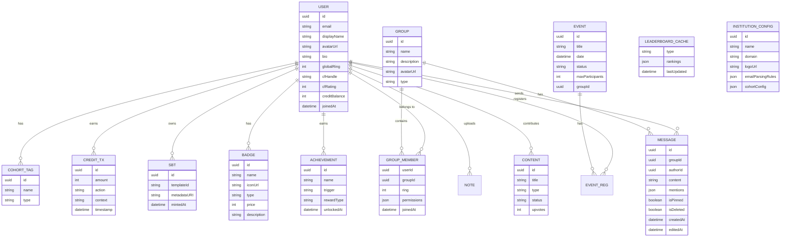

# 📘 master.md — Comflex Feature & Operations Plan

> **Version:** 2.0.0
> **Last Updated:** 2026-04-07
> **Status:** Planning Phase — Pre-Development

---

## Table of Contents

1. [Platform Vision](#1-platform-vision)
2. [Feature Modules](#2-feature-modules)
   - [2.1 Seed Admin & First Boot](#21-seed-admin--first-boot)
   - [2.2 Authentication & User Management](#22-authentication--user-management)
   - [2.3 Automated Cohort Tagging (Admin-Controlled)](#23-automated-cohort-tagging-admin-controlled)
   - [2.4 Ring-Based Hierarchy & Permissions](#24-ring-based-hierarchy--permissions)
   - [2.5 Group Chat System (Discord-Style)](#25-group-chat-system-discord-style)
   - [2.6 User Profiles, Badges & Achievements](#26-user-profiles-badges--achievements)
   - [2.7 Web3 Credits System](#27-web3-credits-system)
   - [2.8 Soulbound Tokens (SBTs)](#28-soulbound-tokens-sbts)
   - [2.9 Codeforces API Integration](#29-codeforces-api-integration)
   - [2.10 Content Library](#210-content-library)
   - [2.11 AI Notes Assistant](#211-ai-notes-assistant)
   - [2.12 Event Management System](#212-event-management-system)
   - [2.13 Leaderboard System](#213-leaderboard-system)
3. [Cross-Cutting Concerns](#3-cross-cutting-concerns)
4. [Data Model Overview](#4-data-model-overview)
5. [Deployment & Operations](#5-deployment--operations)
6. [Roadmap & Phasing](#6-roadmap--phasing)

---

## 1. Platform Vision

Comflex is a **zero-hardcode, institution-agnostic** college community platform that connects students across cohorts through gamified engagement, Discord-style group chats with a ring-based permission hierarchy, achievement tracking, and intelligent tools. It is built as a decoupled system (separate frontend and backend) to enable independent scaling and team velocity.

**Key Principles:**
- **Institution-agnostic** — any college can deploy it by changing configuration, not code.
- **Admin-first setup** — a Seed Admin is auto-created on deployment and controls all institution-specific config.
- **Ring hierarchy** — concentric-ring permission model provides cascading, granular access control.
- **Engagement-first** — credits, SBTs, badges, and leaderboards create intrinsic motivation.
- **Developer-friendly** — API-first contracts, modular architecture, and strict standards.

---

## 2. Feature Modules

---

### 2.1 Seed Admin & First Boot

#### Description
On first deployment, the backend automatically creates a **Seed Admin** account (Ring 0) using credentials from environment variables. This admin bootstraps the entire platform.

#### First Boot Sequence

```
1. Backend starts for the first time.
2. Checks if any Ring 0 user exists in the database.
3. If not, creates the Seed Admin using:
   - SEED_ADMIN_EMAIL
   - SEED_ADMIN_PASSWORD (hashed with bcrypt)
   - SEED_ADMIN_DISPLAY_NAME
4. Seed Admin logs in → Admin Dashboard.
5. Configures email parsing rules (regex, domain, year extraction).
6. Configures institution settings (name, logo, etc.).
7. Registration is now open for students.
```

#### Planned Operations

| Operation | Method | Endpoint | Description |
|---|---|---|---|
| Check First Boot | `GET` | `/api/v1/system/status` | Returns whether the platform has been configured (public). |
| Setup Institution | `POST` | `/api/v1/admin/institution/setup` | Seed Admin: initial institution config (name, domain, logo). |
| Get Institution Config | `GET` | `/api/v1/admin/institution` | Admin: retrieve current institution settings. |
| Update Institution Config | `PATCH` | `/api/v1/admin/institution` | Admin: update institution settings. |

#### Key Rules
- The seed process is **idempotent** — re-running does NOT create duplicates.
- Registration is **gated** — user registration is disabled until the Seed Admin completes the tagging configuration.
- Seed Admin credentials come from **environment variables only** — never from code or config files committed to the repo.

---

### 2.2 Authentication & User Management

#### Description
Secure email + password authentication with JWT-based session management. Supports registration, login, logout, password reset, and profile management.

#### Planned Operations

| Operation | Method | Endpoint | Description |
|---|---|---|---|
| Register | `POST` | `/api/v1/auth/register` | Create a new user account. Triggers cohort auto-tagging. |
| Login | `POST` | `/api/v1/auth/login` | Authenticate and receive JWT + refresh token. |
| Logout | `POST` | `/api/v1/auth/logout` | Invalidate the current session / refresh token. |
| Refresh Token | `POST` | `/api/v1/auth/refresh` | Issue a new access token using a valid refresh token. |
| Forgot Password | `POST` | `/api/v1/auth/forgot-password` | Send password reset email. |
| Reset Password | `POST` | `/api/v1/auth/reset-password` | Reset password using the emailed token. |
| Get Profile | `GET` | `/api/v1/users/me` | Retrieve the authenticated user's full profile. |
| Update Profile | `PATCH` | `/api/v1/users/me` | Update display name, avatar, bio, badge selection, etc. |
| Upload Avatar | `POST` | `/api/v1/users/me/avatar` | Upload a profile picture (JPEG/PNG/WebP, max 5MB). |
| Get User (Admin) | `GET` | `/api/v1/users/:id` | Admin-only: retrieve any user's profile. |
| List Users (Admin) | `GET` | `/api/v1/users` | Admin-only: list/search all users with filters. |

#### Frontend States
- **Login Page:** Email/password form → Loading spinner → Success redirect / Error message.
- **Registration Page:** Multi-step form → Validation → Loading → Success (auto-login) / Error. Registration disabled if system not configured.
- **Profile Page:** Skeleton loader → Rendered profile with avatar, badges, achievements → Edit mode → Save loading → Confirmation.

#### Key Rules
- Passwords hashed with bcrypt (min cost factor 12).
- Access tokens expire in ≤ 15 minutes; refresh tokens expire in ≤ 7 days.
- Rate limit login attempts (max 5 per minute per IP).
- Avatar images are resized server-side to 256×256 and 64×64 (thumbnail).

---

### 2.3 Automated Cohort Tagging (Admin-Controlled)

#### Description
The **Admin** (Ring 0) configures the tagging logic through the Admin Dashboard. When a user registers, the backend applies the admin-defined rules to extract a cohort year from the email and auto-assign the user to groups.

#### Admin Configuration Interface

The Admin Dashboard provides a UI to configure:

| Setting | Type | Example | Purpose |
|---|---|---|---|
| Email regex pattern | string | `(\d{2})bcs\d+@inst\.edu` | Extract year identifier from email |
| Year capture group | integer | `1` | Which regex group holds the year |
| Year-to-cohort map | key-value | `28 → "Class of 2028"` | Human-readable cohort names |
| Cross-year senior offset | integer | `-1` | Auto-join group with year - 1 |
| Cross-year junior offset | integer | `+1` | Auto-join group with year + 1 |
| Fallback behavior | enum | `no-tags` / `require-manual` | Behavior when email can't be parsed |
| Senior auto-elevation | boolean | `true` | Whether seniors auto-get Ring 2 in cross-year groups |

#### Tagging Logic

```
Input:  user email + admin-defined parsing rules

Step 1: Apply admin's regex to extract year identifier.
Step 2: Map year identifier to cohort name using admin's mapping.
Step 3: Create/join groups:
   → Primary cohort group:        cohort-{year}
   → Cross-year senior group:     cohort-{year}-{year-1}
   → Cross-year junior group:     cohort-{year}-{year+1}
Step 4: Set ring levels per group:
   → Primary cohort:              Ring 3 (member)
   → Cross-year where user is SENIOR: Ring 2 (auto-elevated)
   → Cross-year where user is JUNIOR: Ring 3 (member)
```

#### Planned Operations

| Operation | Method | Endpoint | Description |
|---|---|---|---|
| Get Tagging Config | `GET` | `/api/v1/admin/cohort-config` | Admin: retrieve current email parsing rules. |
| Update Tagging Config | `PUT` | `/api/v1/admin/cohort-config` | Admin: update the email parsing regex / domain rules. |
| Preview Tagging | `POST` | `/api/v1/admin/cohort-config/preview` | Admin: test a regex against a sample email (dry run). |
| Get User Tags | `GET` | `/api/v1/users/me/tags` | Retrieve the current user's cohort tags. |
| Trigger Re-Tag | `POST` | `/api/v1/admin/users/:id/retag` | Admin: re-process a user's email and reassign tags. |
| Bulk Re-Tag | `POST` | `/api/v1/admin/users/retag-all` | Admin: re-process all users (after rule change). |

#### Key Rules
- Parsing rules are **never hardcoded** — Admin configures them via Dashboard.
- Cross-year groups are bidirectional (`cohort-28-27` ≡ `cohort-27-28`, same group).
- Unparseable emails → behavior defined by Admin's fallback setting.
- Changing parsing rules does NOT retroactively re-tag — Admin must trigger bulk re-tag explicitly.

---

### 2.4 Ring-Based Hierarchy & Permissions

#### Description
A concentric-ring permission model controlling access at platform-wide and per-group levels. Lower ring = more power. This replaces the simple 3-role system with a flexible, cascading hierarchy.

#### Ring Definitions

| Ring | Name | Scope | Description |
|---|---|---|---|
| **Ring 0** | Admin | Global + all groups | Full platform control. Created on deployment. |
| **Ring 1** | Manager | Global + assigned groups | Manages groups, users, events. Elevated by Ring 0. |
| **Ring 2** | Elevated Member | Per-group | Moderation powers (mute, kick, add, delete messages). Auto-assigned to seniors in cross-year groups. |
| **Ring 3** | Member | Per-group | Default for new users. Read/write messages, react, self-manage. |
| **Ring 4+** | Restricted | Per-group | Muted, read-only, or otherwise restricted. Applied as moderation action. |

#### Platform-Wide Ring Operations

| Operation | Method | Endpoint | Description |
|---|---|---|---|
| Get User Ring (Global) | `GET` | `/api/v1/users/:id/ring` | Get a user's global ring level. |
| Set User Ring (Global) | `PATCH` | `/api/v1/admin/users/:id/ring` | Admin: change a user's global ring. |
| Get User Ring (Group) | `GET` | `/api/v1/groups/:groupId/members/:userId/ring` | Get a user's ring in a specific group. |
| Set User Ring (Group) | `PATCH` | `/api/v1/groups/:groupId/members/:userId/ring` | Elevate/de-elevate a user in a group (ring rules enforced). |
| Get User Permissions (Group) | `GET` | `/api/v1/groups/:groupId/members/:userId/permissions` | Get a user's granular permissions in a group. |
| Set User Permissions (Group) | `PATCH` | `/api/v1/groups/:groupId/members/:userId/permissions` | Assign/revoke granular permissions (ring rules enforced). |

#### Ring Rule Enforcement (API Middleware)

Every endpoint that involves elevation, de-elevation, or permission changes **MUST** enforce these rules:

```
ELEVATION:
  actor.ring < target.ring  → actor can elevate target to MIN(actor.ring, desiredRing)
  actor.ring >= target.ring → REJECT (403)
  actor.ring == 0           → can elevate anyone to any ring

DE-ELEVATION:
  actor.ring < target.ring  → actor can de-elevate target to any ring > actor.ring
  actor.ring >= target.ring → REJECT (403)
  actor cannot de-elevate self → REJECT (403)

PERMISSION CHANGES:
  actor.ring < target.ring  → actor can modify target's permissions
  actor.ring >= target.ring → REJECT (403)
```

---

### 2.5 Group Chat System (Discord-Style)

#### Description
Real-time messaging in cohort groups with granular, per-user permissions. Supports text messages, mentions, pinned messages, attachments, typing indicators, and moderation actions — all governed by the ring hierarchy.

#### Architecture

```
Frontend ←─── WebSocket (real-time) ───→ Chat Server (Backend)
Frontend ←─── REST API (CRUD/history) ──→ Chat Server (Backend)
                                               │
                                          ┌────▼────┐
                                          │ Message  │
                                          │ Broker   │
                                          └────┬─────┘
                                               │
                                          ┌────▼────┐
                                          │ Database │
                                          └─────────┘
```

#### Granular Permissions (Per-Group, Per-User)

| Permission Key | Description | Ring 3 Default | Ring 2 Default |
|---|---|---|---|
| `can_send_messages` | Send text messages | ✅ | ✅ |
| `can_delete_own_messages` | Delete own messages | ✅ | ✅ |
| `can_delete_others_messages` | Delete other users' messages | ❌ | ✅ |
| `can_mute_members` | Mute members at ring > self | ❌ | ✅ |
| `can_kick_members` | Remove members from group | ❌ | ✅ |
| `can_add_members` | Add new members to group | ❌ | ✅ |
| `can_tag_members` | Use @mentions | ✅ | ✅ |
| `can_manage_economy` | Award/deduct credits in group | ❌ | ❌ |
| `can_create_events` | Create events scoped to group | ❌ | ❌ |
| `can_pin_messages` | Pin messages in chat | ❌ | ✅ |
| `can_manage_roles` | Change ring levels (subject to ring rules) | ❌ | ❌ |
| `can_edit_group_info` | Change group name, description, avatar | ❌ | ❌ |
| `can_stop_others_tagging` | Revoke @mention ability from specific users | ❌ | ✅ |

#### Chat REST API Operations

| Operation | Method | Endpoint | Description |
|---|---|---|---|
| List Groups | `GET` | `/api/v1/groups` | List all groups the user belongs to. |
| Get Group | `GET` | `/api/v1/groups/:id` | Get group info (name, description, member count). |
| Create Group | `POST` | `/api/v1/groups` | Admin/Manager: create a new group. |
| Update Group | `PATCH` | `/api/v1/groups/:id` | Update group name, description, avatar. |
| Delete Group | `DELETE` | `/api/v1/groups/:id` | Admin: delete a group. |
| List Members | `GET` | `/api/v1/groups/:id/members` | List group members with ring levels and badges. |
| Add Member | `POST` | `/api/v1/groups/:id/members` | Add a user to the group (permission check). |
| Remove Member | `DELETE` | `/api/v1/groups/:id/members/:userId` | Kick a user from the group (ring check). |
| Mute Member | `POST` | `/api/v1/groups/:id/members/:userId/mute` | Mute a user for a duration (ring check). |
| Unmute Member | `DELETE` | `/api/v1/groups/:id/members/:userId/mute` | Unmute a user (ring check). |
| Get Messages | `GET` | `/api/v1/groups/:id/messages` | Paginated message history (newest first). |
| Get Message | `GET` | `/api/v1/groups/:id/messages/:msgId` | Get a single message by ID. |
| Send Message | `POST` | `/api/v1/groups/:id/messages` | Send a message (REST fallback, prefer WebSocket). |
| Edit Message | `PATCH` | `/api/v1/groups/:id/messages/:msgId` | Edit own message. |
| Delete Message | `DELETE` | `/api/v1/groups/:id/messages/:msgId` | Delete a message (own or others with permission). |
| Pin Message | `POST` | `/api/v1/groups/:id/messages/:msgId/pin` | Pin a message (permission check). |
| Unpin Message | `DELETE` | `/api/v1/groups/:id/messages/:msgId/pin` | Unpin a message. |
| Get Pinned Messages | `GET` | `/api/v1/groups/:id/messages/pinned` | List all pinned messages. |
| Report Message | `POST` | `/api/v1/groups/:id/messages/:msgId/report` | Report a message for review. |

#### WebSocket Events

| Direction | Event | Payload | Description |
|---|---|---|---|
| Server → Client | `message:new` | Full message object (incl. author badges) | New message |
| Server → Client | `message:edit` | Updated message object | Message edited |
| Server → Client | `message:delete` | `{ messageId, groupId }` | Message deleted |
| Server → Client | `message:pin` | `{ messageId, groupId, isPinned }` | Message pinned/unpinned |
| Server → Client | `member:muted` | `{ userId, groupId, mutedUntil }` | Member muted |
| Server → Client | `member:unmuted` | `{ userId, groupId }` | Member unmuted |
| Server → Client | `member:kicked` | `{ userId, groupId }` | Member removed |
| Server → Client | `member:joined` | `{ user, groupId }` | New member joined |
| Server → Client | `member:ring_changed` | `{ userId, groupId, oldRing, newRing }` | Ring changed |
| Server → Client | `member:permission_changed` | `{ userId, groupId, permissions }` | Permissions updated |
| Server → Client | `typing:start` | `{ userId, displayName, groupId }` | User typing |
| Server → Client | `typing:stop` | `{ userId, groupId }` | User stopped typing |
| Client → Server | `message:send` | `{ groupId, content, mentions?, attachments? }` | Send message |
| Client → Server | `typing:start` | `{ groupId }` | Start typing |
| Client → Server | `typing:stop` | `{ groupId }` | Stop typing |

#### Message Schema

```json
{
  "id": "uuid",
  "groupId": "uuid",
  "authorId": "uuid",
  "author": {
    "displayName": "Tarun",
    "avatarUrl": "https://storage.example.com/avatars/uuid.webp",
    "ring": 2,
    "displayBadges": [
      { "id": "code-warrior", "name": "Code Warrior", "iconUrl": "https://..." },
      { "id": "streak-master", "name": "Streak Master", "iconUrl": "https://..." }
    ]
  },
  "content": "Hey everyone! Check out this problem.",
  "attachments": [],
  "mentions": ["user-uuid-1"],
  "isPinned": false,
  "isDeleted": false,
  "createdAt": "2026-04-07T00:00:00Z",
  "editedAt": null
}
```

#### Key Rules
- All moderation actions (mute, kick, delete others' messages) require `actor.ring < target.ring`.
- Muted users can read messages but cannot send, react, or mention.
- Deleted messages show `[Message deleted]` — not removed from database.
- Messages support rich mentions: `@username` resolves to a user card popup.
- WebSocket connections require a valid JWT for handshake.
- Message history is loaded via paginated REST; WebSocket is for real-time new messages only.

---

### 2.6 User Profiles, Badges & Achievements

#### Description
Every user has a rich, customizable profile with avatar, bio, displayable badges, earned achievements, and linked external accounts. Badges appear next to the user's name in chats (like Discord), and users choose which badges to showcase.

#### Profile Fields

| Field | Type | Editable | Description |
|---|---|---|---|
| `displayName` | string | ✅ | User's chosen display name (unique) |
| `avatarUrl` | string | ✅ | Profile picture (JPEG/PNG/WebP, max 5MB, resized server-side) |
| `bio` | string | ✅ | Short bio (max 500 chars) |
| `cohortTags` | string[] | ❌ | Auto-assigned cohort groups |
| `globalRing` | integer | ❌ | Platform-wide ring level |
| `displayBadges` | Badge[] | ✅ | Currently displayed badges (user-selected, max 5) |
| `allBadges` | Badge[] | ❌ | All badges earned or purchased |
| `achievements` | Achievement[] | ❌ | Full achievement list |
| `cfHandle` | string | ✅ | Linked Codeforces handle |
| `cfRating` | integer | ❌ | Current CF rating (auto-synced) |
| `creditBalance` | integer | ❌ | Current Web3 credit balance |
| `sbtCount` | integer | ❌ | Number of SBTs owned |
| `joinedAt` | datetime | ❌ | Registration timestamp |

#### Badge System

##### Badge Types

| Type | Source | Transferable | Removable |
|---|---|---|---|
| **Achievement Badge** | Auto-awarded on milestone | ❌ | Can be hidden, not removed |
| **SBT Badge** | Mirrors minted SBT | ❌ | Tied to SBT lifecycle |
| **Purchased Badge** | Bought with Web3 credits | ❌ | Non-refundable |
| **Admin-Granted Badge** | Manually given by Admin | ❌ | Admin can revoke |

##### Badge Display Rules
- Users choose up to **5 badges** to display at a time.
- Displayed badges appear: in chat messages (next to name), on profile pages, and on leaderboard entries.
- Badges are rendered as small icons with tooltips showing the badge name and description.

##### Planned Operations

| Operation | Method | Endpoint | Description |
|---|---|---|---|
| List All Badges | `GET` | `/api/v1/badges` | List all available badges (earned, purchased, locked). |
| Get User Badges | `GET` | `/api/v1/users/:id/badges` | Get a user's earned/purchased badges. |
| Set Display Badges | `PATCH` | `/api/v1/users/me/badges/display` | Choose which badges to display (max 5). |
| Purchase Badge | `POST` | `/api/v1/badges/:id/purchase` | Buy a cosmetic badge with credits. |
| Grant Badge | `POST` | `/api/v1/admin/users/:id/badges` | Admin: grant a badge to a user. |
| Revoke Badge | `DELETE` | `/api/v1/admin/users/:id/badges/:badgeId` | Admin: revoke an admin-granted badge. |
| Create Badge Template | `POST` | `/api/v1/admin/badges` | Admin: create a new badge type. |
| List Badge Store | `GET` | `/api/v1/badges/store` | List purchasable badges with prices. |

#### Achievement System

| Achievement | Trigger Condition | Rewards |
|---|---|---|
| **Code Warrior** | Reach CF `Expert` or higher | Badge + SBT + Credits |
| **Streak Master** | 30-day login streak | Badge + SBT + Credits |
| **Content Star** | 10+ approved content contributions | Badge + SBT |
| **Event Champion** | Win a platform event | Badge + SBT |
| **Community Builder** | Admin-granted | Badge + SBT |
| **First Steps** | Complete profile (avatar + bio + CF link) | Badge |
| **Social Butterfly** | Join 5+ groups | Badge |
| **Chatterbox** | Send 1000+ messages | Badge |
| **Helping Hand** | 50+ content upvotes received | Badge |
| **Night Owl** | 100+ messages sent between 12 AM–6 AM | Badge |

##### Planned Operations

| Operation | Method | Endpoint | Description |
|---|---|---|---|
| List Achievements | `GET` | `/api/v1/achievements` | List all achievements with progress tracking. |
| Get User Achievements | `GET` | `/api/v1/users/:id/achievements` | Get a user's completed and in-progress achievements. |
| Check Achievement Progress | `GET` | `/api/v1/achievements/:id/progress` | Get current progress toward an achievement. |

#### Profile Picture Rules
- Accepted formats: JPEG, PNG, WebP. Max: 5MB.
- Server resizes to 256×256 (full) and 64×64 (thumbnail).
- Stored in S3-compatible object storage, served via CDN/signed URLs.
- Default avatar: auto-generated from initials + color based on user ID hash.
- Appears in: chat messages, profile pages, leaderboards, member lists, event attendees.

---

### 2.7 Web3 Credits System

#### Description
A blockchain-based (or hybrid on/off-chain) credit economy that rewards users for platform engagement. Credits can be earned, spent (badge purchases), and managed (by admins and users with `can_manage_economy`).

#### Earning Actions

| Action | Credits Awarded | Notes |
|---|---|---|
| Event attendance | Configurable per event | Set by event creator |
| Content contribution (approved) | Configurable | Approved by Coordinator/Admin |
| Codeforces rating milestone | Configurable per tier | Based on CF rating thresholds |
| Daily login streak | Configurable | e.g., 1 credit/day, bonus at 7-day streak |
| Peer endorsement received | Configurable | Anti-gaming limits apply |
| Achievement unlocked | Per achievement | Auto-awarded |

#### Spending Actions

| Action | Credits Cost | Notes |
|---|---|---|
| Purchase cosmetic badge | Per badge | Non-refundable |
| Purchase poster/cosmetic | Per item | Profile customization |

#### Planned Operations

| Operation | Method | Endpoint | Description |
|---|---|---|---|
| Get Balance | `GET` | `/api/v1/credits/balance` | Get the current user's credit balance. |
| Get History | `GET` | `/api/v1/credits/history` | Get the current user's credit transaction log. |
| Award Credits | `POST` | `/api/v1/admin/credits/award` | Admin: manually award credits to a user. |
| Deduct Credits | `POST` | `/api/v1/admin/credits/deduct` | Admin: deduct credits from a user. |
| Group Award | `POST` | `/api/v1/groups/:id/credits/award` | Economy manager: award credits in a group context. |
| Get Credit Config | `GET` | `/api/v1/admin/credits/config` | Admin: view credit earning rules. |
| Update Credit Config | `PUT` | `/api/v1/admin/credits/config` | Admin: update credit earning rules. |

#### Key Rules
- All credit mutations are **transactional** and **audit-logged**.
- Credits cannot go negative.
- Credit values for each action are **configurable in DB** — not hardcoded.
- `can_manage_economy` permission holders can award credits in their group (limited by configurable daily cap).
- Web3 on-chain sync (if applicable) happens asynchronously.

---

### 2.8 Soulbound Tokens (SBTs)

#### Description
Non-transferable NFTs minted on-chain to represent permanent achievements, certifications, and milestones. SBTs also auto-grant corresponding badges.

#### Achievement Types

| Achievement | Trigger | SBT Metadata |
|---|---|---|
| Event Champion | Win a platform event | Event name, date, rank |
| Code Warrior | Reach Codeforces `Expert` or higher | CF handle, rating, timestamp |
| Content Star | 10+ approved contributions | Contribution count, date |
| Streak Master | 30-day login streak | Streak length, dates |
| Community Builder | Assigned by Admin | Custom description |

#### Planned Operations

| Operation | Method | Endpoint | Description |
|---|---|---|---|
| List User SBTs | `GET` | `/api/v1/sbt/mine` | Get the current user's SBTs. |
| Get SBT Detail | `GET` | `/api/v1/sbt/:id` | Get metadata for a specific SBT. |
| Mint SBT | `POST` | `/api/v1/admin/sbt/mint` | Admin: mint a new SBT for a user. |
| List SBT Templates | `GET` | `/api/v1/admin/sbt/templates` | Admin: view available SBT templates. |
| Create SBT Template | `POST` | `/api/v1/admin/sbt/templates` | Admin: create a new achievement template. |
| Revoke SBT | `DELETE` | `/api/v1/admin/sbt/:id` | Admin: revoke (burn) an SBT + associated badge. |

#### Key Rules
- SBTs are **soulbound** — transfer functions are disabled at the smart contract level.
- Minting requires Admin role.
- Minting an SBT auto-grants the corresponding badge.
- Revoking an SBT auto-revokes the corresponding badge.
- SBT metadata is stored on IPFS or equivalent decentralized storage.
- All SBT events are logged on-chain and in the application DB.

---

### 2.9 Codeforces API Integration

#### Description
Pulls real-time competitive programming data from the Codeforces public API to display user stats, track progress, and award credits/SBTs based on rating milestones.

#### Data Points Pulled

| Data | CF API Endpoint | Usage |
|---|---|---|
| User info | `user.info` | Display CF rating, rank, avatar |
| Rating history | `user.rating` | Chart rating progression over time |
| Submission history | `user.status` | Track recent submissions, problem-solving activity |
| Contest standings | `contest.standings` | Show contest results for platform events |

#### Planned Operations

| Operation | Method | Endpoint | Description |
|---|---|---|---|
| Link CF Handle | `POST` | `/api/v1/codeforces/link` | Link a Codeforces handle to the user's account. |
| Unlink CF Handle | `DELETE` | `/api/v1/codeforces/link` | Remove the CF handle link. |
| Get CF Stats | `GET` | `/api/v1/codeforces/stats` | Get the user's CF stats (cached). |
| Sync CF Data | `POST` | `/api/v1/codeforces/sync` | Trigger a manual re-sync of CF data. |
| Get CF Leaderboard | `GET` | `/api/v1/codeforces/leaderboard` | Platform-wide CF rating leaderboard. |

#### Key Rules
- CF data is **cached** (configurable TTL, default 6 hours) to avoid rate limiting.
- Handle verification: user must prove ownership (e.g., by setting a specific string in their CF bio temporarily).
- CF API failures must be handled gracefully — show cached data with a "last synced" timestamp.

---

### 2.10 Content Library

#### Description
A curated, searchable repository of study materials including notes, past papers, tutorials, cheat sheets, and resource links. Supports tagging, upvoting, and cohort-based filtering.

#### Content Types
- 📄 Documents (PDF, DOCX upload → stored in object storage)
- 🔗 External Links (YouTube, blog posts, documentation)
- 📝 Rich Text Posts (Markdown-based posts created in-platform)

#### Planned Operations

| Operation | Method | Endpoint | Description |
|---|---|---|---|
| List Content | `GET` | `/api/v1/content` | Search/filter content (by tag, cohort, type, subject). |
| Get Content | `GET` | `/api/v1/content/:id` | Retrieve a single content item with metadata. |
| Create Content | `POST` | `/api/v1/content` | Submit new content (pending approval). |
| Update Content | `PATCH` | `/api/v1/content/:id` | Edit own content (or any, for Coordinator/Admin). |
| Delete Content | `DELETE` | `/api/v1/content/:id` | Delete content (own or moderated). |
| Approve Content | `PATCH` | `/api/v1/content/:id/approve` | Coordinator/Admin: approve pending content. |
| Upvote Content | `POST` | `/api/v1/content/:id/upvote` | Upvote a content item (awards credits to author). |
| Report Content | `POST` | `/api/v1/content/:id/report` | Flag content for review. |

#### Key Rules
- New submissions go into a **pending** state until approved by a Coordinator or Admin.
- File uploads are virus-scanned before being made available.
- Content is tagged with cohort groups for visibility filtering.
- Upvotes contribute to credits for the content author.

---

### 2.11 AI Notes Assistant

#### Description
An AI-powered tool that helps students create, organize, summarize, and query their notes. Supports natural language Q&A over uploaded notes, auto-summarization, and study plan generation.

#### Capabilities

| Feature | Description |
|---|---|
| **Upload & Parse** | Upload notes (PDF, Markdown, text) → AI parses and indexes them. |
| **Summarize** | Generate concise summaries of uploaded notes. |
| **Q&A** | Ask natural language questions about your notes → get contextual answers. |
| **Flashcard Generation** | Auto-generate flashcards from notes for spaced repetition study. |
| **Study Plan** | Generate a study plan based on syllabus + available notes. |

#### Planned Operations

| Operation | Method | Endpoint | Description |
|---|---|---|---|
| Upload Notes | `POST` | `/api/v1/notes/upload` | Upload a file for AI indexing. |
| List Notes | `GET` | `/api/v1/notes` | List all uploaded notes for the user. |
| Get Summary | `GET` | `/api/v1/notes/:id/summary` | Get AI-generated summary of a note. |
| Ask Question | `POST` | `/api/v1/notes/ask` | Ask a question over the user's note corpus. |
| Generate Flashcards | `POST` | `/api/v1/notes/:id/flashcards` | Generate flashcards from a specific note. |
| Delete Notes | `DELETE` | `/api/v1/notes/:id` | Delete an uploaded note and its index. |

#### Key Rules
- Notes are **private per user** — no cross-user access unless explicitly shared.
- AI processing is **asynchronous** — upload returns immediately, processing status is polled.
- Token/cost limits per user are **configurable** to prevent abuse.
- All AI outputs include a disclaimer: "AI-generated — verify for accuracy."

---

### 2.12 Event Management System

#### Description
A full event lifecycle system supporting creation, registration, attendance tracking, and post-event analytics. Events can be created by Admins, Managers, or users with `can_create_events` permission in a group.

#### Event Lifecycle

```
[Draft] → [Published] → [Registration Open] → [In Progress] → [Completed] → [Archived]
```

#### Planned Operations

| Operation | Method | Endpoint | Description |
|---|---|---|---|
| Create Event | `POST` | `/api/v1/events` | Create a new event (permission check: Ring ≤ 1 or `can_create_events`). |
| List Events | `GET` | `/api/v1/events` | List upcoming/past events with filters. |
| Get Event | `GET` | `/api/v1/events/:id` | Get full event details. |
| Update Event | `PATCH` | `/api/v1/events/:id` | Edit event details (if not yet completed). |
| Delete Event | `DELETE` | `/api/v1/events/:id` | Cancel/delete an event. |
| Register | `POST` | `/api/v1/events/:id/register` | Register the current user for an event. |
| Unregister | `DELETE` | `/api/v1/events/:id/register` | Cancel registration. |
| Mark Attendance | `POST` | `/api/v1/events/:id/attendance` | Mark attendees (permission check). |
| Get Attendees | `GET` | `/api/v1/events/:id/attendees` | List registered/attended users. |
| Get Event Analytics | `GET` | `/api/v1/events/:id/analytics` | Post-event stats (attendance rate, feedback). |

#### Key Rules
- Events can be scoped to groups — users only see events for their groups (or public events).
- Registration limits are enforced (configurable per event).
- Attendance triggers credit distribution automatically.
- Completed events can trigger SBT minting for winners/participants.
- Group-level `can_create_events` permission allows non-admin users to create events.

---

### 2.13 Leaderboard System

#### Description
Dynamic, real-time leaderboards ranking users across multiple dimensions. Supports filtering by cohort, time period, and metric type.

#### Leaderboard Types

| Leaderboard | Metric | Source |
|---|---|---|
| **Overall Credits** | Total credits earned | Credits system |
| **Codeforces Rating** | CF rating | CF API integration |
| **Event Participation** | Number of events attended | Event system |
| **Content Contribution** | Number of approved contributions | Content library |
| **Streak** | Current/longest login streak | Auth system |
| **Chat Activity** | Messages sent (per group or global) | Chat system |

#### Planned Operations

| Operation | Method | Endpoint | Description |
|---|---|---|---|
| Get Leaderboard | `GET` | `/api/v1/leaderboard` | Get ranked list. Query params: `type`, `cohort`, `period`, `limit`. |
| Get User Rank | `GET` | `/api/v1/leaderboard/me` | Get the current user's rank across all boards. |

#### Key Rules
- Leaderboards are **cached** and refreshed at configurable intervals (default: every 15 minutes).
- Ties are resolved by earliest achievement timestamp.
- Leaderboards can be filtered by cohort tag for intra-cohort competition.
- Top 3 on any leaderboard at end of semester can trigger SBT minting.
- Leaderboard entries include user avatar and display badges.

---

## 3. Cross-Cutting Concerns

### 3.1 Notifications
- In-app notification system for events, credit awards, SBT minting, moderation actions, ring changes, and badge grants.
- Notifications for chat mentions (@user) — delivered even if user is offline.
- Future: Email/push notification support.

### 3.2 Audit Logging
- All admin/manager actions are logged (who, what, when, affected entity).
- Credit mutations, role/ring changes, SBT operations, and moderation actions are always logged.
- Ring elevation/de-elevation fully audit-trailed.

### 3.3 Rate Limiting
- All public-facing endpoints are rate-limited.
- Chat: max 30 messages per minute per user.
- Configurable per-endpoint limits stored in environment/config.

### 3.4 File Storage
- Uploaded files (content library, notes, avatars, badge icons) stored in object storage (S3-compatible).
- Files served via signed, time-limited URLs.
- Avatar images auto-resized to standard dimensions server-side.

### 3.5 Search
- Full-text search across content library, events, and chat messages.
- Implementation: database-native search or dedicated search engine (configurable).

---

## 4. Data Model Overview



---

## 5. Deployment & Operations

### Environments

| Environment | Branch | Purpose |
|---|---|---|
| **Production** | `main` | Live, user-facing. Zero direct deploys — only via CI/CD after PR merge. |
| **Staging** | `dev` | Integration testing. Auto-deployed on merge to `dev`. |
| **Local** | Feature branches | Developer machines. Uses Docker Compose for full stack. |

### Environment Variables (Partial List)

```
# Seed Admin (REQUIRED on first deploy)
SEED_ADMIN_EMAIL=
SEED_ADMIN_PASSWORD=
SEED_ADMIN_DISPLAY_NAME=

# Database
DATABASE_URL=
DATABASE_POOL_SIZE=

# Auth
JWT_SECRET=
JWT_ACCESS_EXPIRY=
JWT_REFRESH_EXPIRY=

# WebSocket
WS_HEARTBEAT_INTERVAL=
WS_MAX_CONNECTIONS=

# Web3
WEB3_PROVIDER_URL=
SBT_CONTRACT_ADDRESS=

# AI Notes
AI_PROVIDER_API_KEY=
AI_MAX_TOKENS_PER_USER=

# Codeforces
CF_CACHE_TTL_SECONDS=

# File Storage
S3_BUCKET=
S3_REGION=
S3_ACCESS_KEY=
S3_SECRET_KEY=

# Institution Config (initial — then managed via Admin Dashboard)
INSTITUTION_NAME=
INSTITUTION_DOMAIN=

# Rate Limiting
RATE_LIMIT_CHAT_MSG_PER_MIN=30
RATE_LIMIT_API_PER_MIN=100
```

---

## 6. Roadmap & Phasing

### Phase 1 — Foundation (Weeks 1–3)
- [ ] Set up repositories, CI/CD, and environments
- [ ] Implement seed admin creation on first boot
- [ ] Build Admin Dashboard (institution config + email parsing rules UI)
- [ ] Implement auth (register, login, JWT, password reset)
- [ ] Implement automated cohort tagging (admin-controlled rules)
- [ ] Implement ring-based hierarchy middleware
- [ ] Build login/registration UI
- [ ] Build profile page UI (avatar upload, bio, badge selection)

### Phase 2 — Chat & Groups (Weeks 4–6)
- [ ] Build group model (CRUD, membership, ring per group)
- [ ] Implement WebSocket chat server (send, receive, typing indicators)
- [ ] Implement granular per-user permissions in groups
- [ ] Build chat UI (messages, badges next to names, pinning, moderation)
- [ ] Implement senior auto-elevation in cross-year groups
- [ ] Build group management UI (members list, ring changes, permission toggles)

### Phase 3 — Economy & Engagement (Weeks 7–9)
- [ ] Build event management (CRUD, registration, attendance, group-scoped events)
- [ ] Build content library (CRUD, upload, approval workflow)
- [ ] Implement Web3 credits system (earn, spend, group economy)
- [ ] Implement badge system (earn, purchase, display, store)
- [ ] Implement achievement system (triggers, progress tracking, auto-awards)
- [ ] Build leaderboard system (multiple types, cohort filtering, badge display)

### Phase 4 — Advanced Features (Weeks 10–12)
- [ ] Integrate Codeforces API (link, sync, leaderboard)
- [ ] Implement SBT minting (templates, mint, revoke, badge link)
- [ ] Build AI notes assistant (upload, summarize, Q&A, flashcards)
- [ ] Build notification system (in-app, mentions, ring changes)

### Phase 5 — Polish & Launch (Weeks 13–15)
- [ ] Search and filtering improvements
- [ ] Performance optimization and caching
- [ ] WebSocket load testing and optimization
- [ ] Security audit (ring check coverage, rate limiting, XSS/injection)
- [ ] User acceptance testing
- [ ] Production deployment

---

**Last Updated:** 2026-04-07
**Maintained By:** Comflex Core Team
**Version:** 2.0.0
